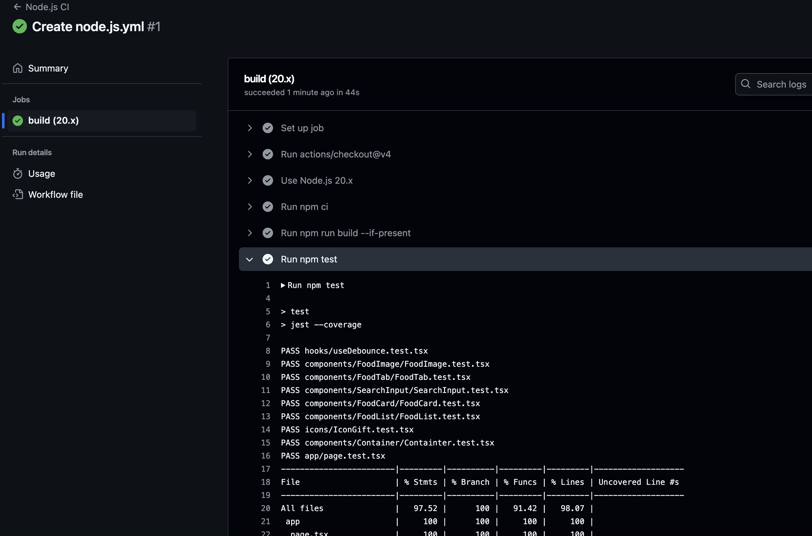

# Next.js + Jest

This is a simple food collection app where users can view the list of foods, search the favorite food by name, and filter by food categories.

To run the app locally, follow these steps:

Clone the repository to your local machine:
```bash
 git clone https://github.com/GiaLuongNgo/food-collection.git
 or
 git clone git@github.com:GiaLuongNgo/food-collection.git
```

Navigate to the project directory:
```bash
cd food-collection
```

Install the required dependencies (Node.js version >= v18.18.0 is required):
```bash
npm install
```

Start the local development server:
```bash
npm run dev
```

Open your web browser and visit http://localhost:3000 to access the app.

To run the unit tests locally, follow these steps:

```bash
npm run test
```

The app also have the simple pipeline to checking the building process and running unit tests when devs push a commit, checking at `github Actions` tab



Make sure you have Node.js and npm installed on your machine before proceeding with the above steps.
